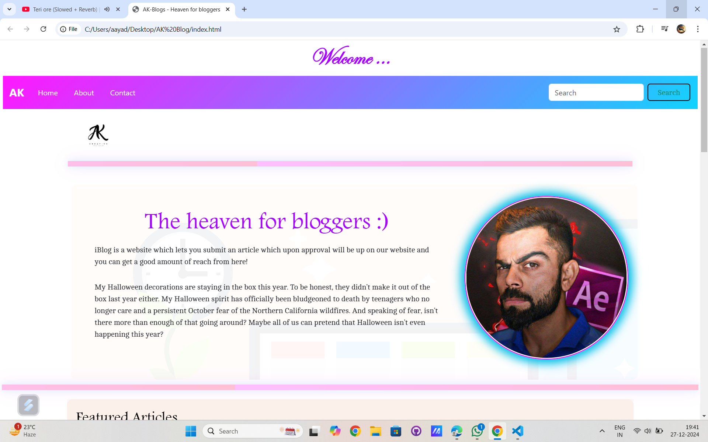
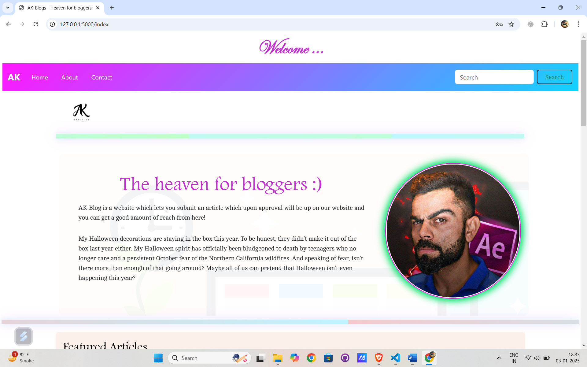
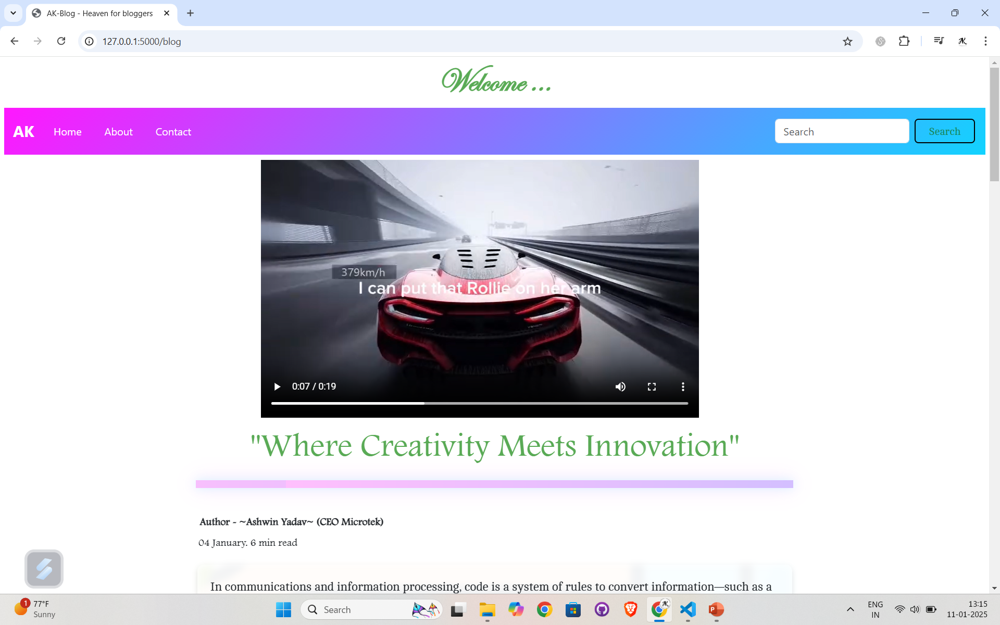
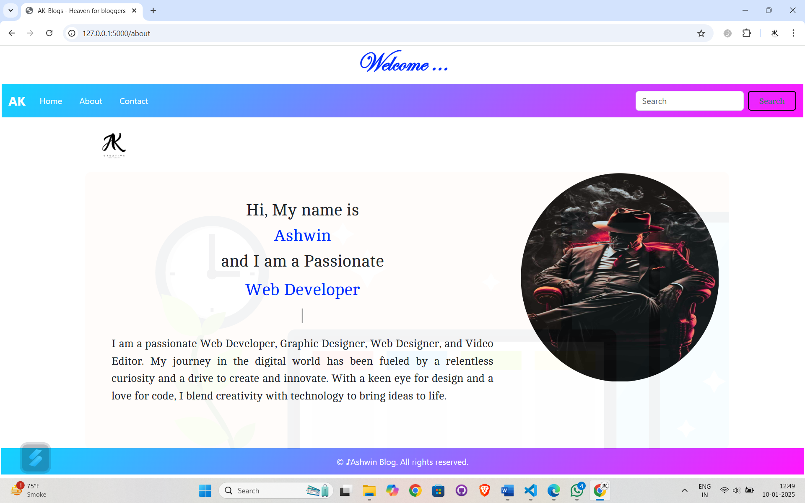

# AK-Blog 🚀

**AK-Blog** is a modern, responsive blog website built using **HTML, CSS, JavaScript, Bootstrap**, and **Flask** for the backend. It supports user authentication and article management, allowing users to submit, view, and explore featured blogs.

## 🖼️ Preview

## 📸 Screenshots

### 🏠 Landing Page

=======
>>>>>>> 9b0fc3325794b080ca2982c48b13c9f1c684238d


## 🌐 Live Demo

Deployed on: [Render](https://ak-blog-uq9p.onrender.com/)  
> https://ak-blog-uq9p.onrender.com

---

## 🛠️ Tech Stack

### 🖥 Frontend:
- HTML5
- CSS3
- JavaScript
- Bootstrap 5

### 🧠 Backend:
- Python (Flask Framework)

### 💾 Database:
- SQLite

### 🔐 Authentication:
- Custom user authentication with Flask

### 🛫 Deployment:
- Render

### 🗃️ Version Control:
- Git & GitHub

---

## 🔑 Features

- 🔐 User Authentication (Register, Login, Logout)
- 📝 Submit Articles (with approval system)
- 📃 Display Featured Articles
- 🎨 Responsive and Modern UI Design
- 🔍 Search Bar Functionality
- 📅 Article metadata (Author, Date, Read Time)
- 📹 Media Support (Images, Videos)
- 📱 Fully responsive across all devices

---

## 📸 Screenshots

| Landing Page |
|-------------|
|  |

 | Blog List |
 |-------------|
 |

| About Me |
|-------------|
 |

| Mobile View |
|-------------|
|  |


---

## 📦 Installation & Setup

1. **Clone the repository**
   ```bash
   git clone https://github.com/Ashwin1718/AK-Blog.git
   cd AK-Blog


**Create and activate a virtual environment (recommended)**
python -m venv venv
source venv/bin/activate  # On Windows: venv\Scripts\activate

**Install dependencies**
pip install -r requirements.txt

**Run the application**
python app.py


🗂 Project Structure
AK-Blog/
│
├── static/
│   ├── css/
│   ├── js/
│   └── images/
│
├── templates/
│   ├── index.html
│   ├── about.html
│   ├── login.html
│   └── ...
│
├── app.py
├── database.db
├── requirements.txt
└── README.md
